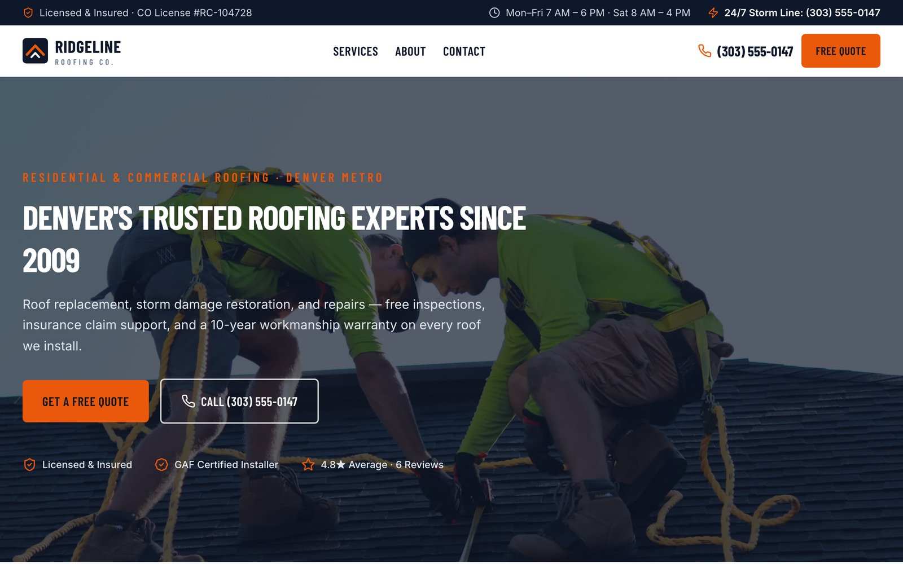

# Ridgeline Lite — Free Roofing Contractor Website Template

A free, production-quality website template for roofing contractors, built
with **Astro 7** and **Tailwind CSS 4**.

 Fast (Lighthouse 95+ across the
board), accessible (WCAG AA), and wired to a single config file so you can
rebrand it in an afternoon.

**[Get Ridgeline Pro →](https://payhip.com/b/GkIRJ)** — the full
version adds the 4-step Quote Wizard, before/after project galleries,
per-city Local SEO landing pages, and more (comparison below).

## Pages included

Home · Services · About · Contact · Quote request · Thank-you · 404

## Features

- **Industrial design system** — two color schemes, switchable with one
  config line; condensed display type; dark "hazard-sign" CTAs
- **Single-config rebrand** — all company info in `src/config/site.ts`
- **Lead forms** — quote + contact forms with Formspree or Netlify Forms
  backends and honeypot anti-spam
- **Mobile sticky call bar** — Call Now / Free Quote pinned after the
  first screen
- **Content collections** — services and reviews as validated
  Markdown/JSON; the aggregate review score computes itself
- **Local SEO basics** — RoofingContractor JSON-LD, per-page meta,
  sitemap, semantic HTML
- ~1 KB of JavaScript per page; images optimized at build time

## Lite vs Pro

| | Lite (free) | **Pro** |
| --- | --- | --- |
| Core pages (Home/Services/About/Contact) | ✅ | ✅ |
| Design system + both color schemes | ✅ | ✅ |
| Sticky mobile call bar | ✅ | ✅ |
| Quote form | Single-step | **4-step Quote Wizard** with per-step validation & anti-spam |
| Service pages | One combined page | **Individual landing page per service** with FAQs & related projects |
| Project gallery | — | **Before/after sliders** (touch/mouse/keyboard) + filterable gallery |
| Local SEO | Basic JSON-LD | **Per-city landing pages** + areaServed/FAQ/Article structured data |
| Reviews | Home carousel | + **Full reviews page** with platform summaries |
| Financing page | — | ✅ Plans, process, compliant disclaimers |
| Blog | — | ✅ 4 SEO articles with TOC |
| Emergency storm banner | — | ✅ Config-toggled, dismissible |
| FAQ system | — | ✅ Categorized accordion + FAQPage schema |
| Documentation | README | Full customization + deployment guides |

**[Upgrade to Ridgeline Pro →](https://payhip.com/b/GkIRJ)** · [Live demo](https://ridgeline-roofing-demo.vercel.app)

## Quick start

```bash
# Requires Node 22.12+
npm install
npm run dev        # → http://localhost:4321
npm run build      # static output in ./dist
```

## Customize

1. **Company info** — edit `src/config/site.ts` (name, phone, address,
   hours, badges, form backend, theme). Every page reads from it.
2. **Domain** — set `site` in `astro.config.mjs` and the sitemap URL in
   `public/robots.txt`.
3. **Services** — edit the MDX files in `src/content/services/`.
4. **Reviews** — edit `src/content/reviews.json` (the aggregate score is
   computed).
5. **Images** — replace the photos in `src/assets/` with your own work.
6. **Forms** — create a free [Formspree](https://formspree.io) form and
   paste its endpoint into `formEndpoint` in `site.ts`; or set
   `formProvider: 'netlify'` when hosting on Netlify.

## Deploy

Static output, zero config on all major hosts — build command
`npm run build`, output directory `dist`:

- **Vercel** — import the repo at [vercel.com/new](https://vercel.com/new)
- **Netlify** — import at [app.netlify.com](https://app.netlify.com)
- **Cloudflare Pages** — Workers & Pages → Create → connect the repo

## License & credits

MIT — free for personal and commercial use. The footer's small
"Made with Ridgeline" credit link is appreciated but not required by the
license.

Demo photographs are from [Unsplash](https://unsplash.com) (Unsplash License)
— replace them with your own project photography before launch. Icon path
data adapted from [Lucide](https://lucide.dev) (ISC). Fonts (Barlow
Condensed, Inter) under the SIL Open Font License, self-hosted via
[Fontsource](https://fontsource.org).

## About this fork

Forked from [JulyFire365/ridgeline-lite](https://github.com/JulyFire365/ridgeline-lite)
and upgraded from Astro 5.18 to **Astro 7.3** (through Astro 6) with
byte-for-byte rendered-output parity verified against the original — see
[CHANGELOG.md](CHANGELOG.md) and [MIGRATION.md](MIGRATION.md) for details.
Upstream credit for the template design and content goes to the original
author.
